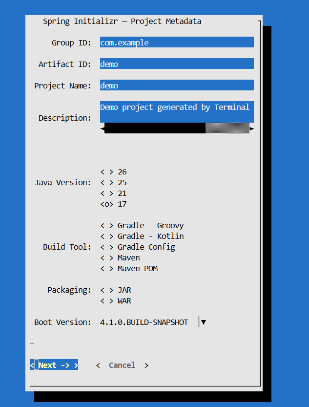
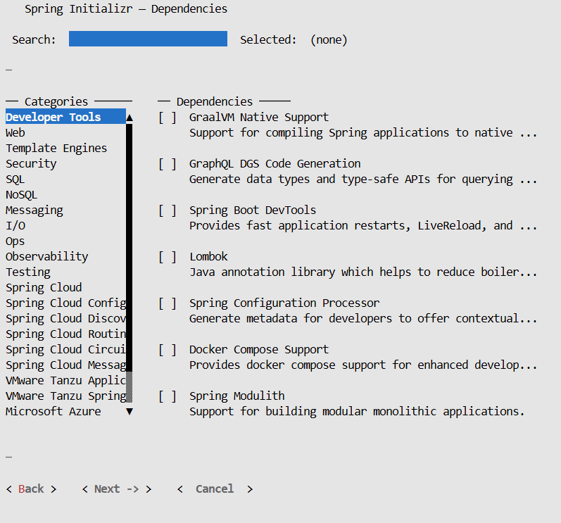

# Spring TUI — Spring Initializr in Your Terminal

> Scaffold Spring Boot projects without leaving your terminal.  
> No browser. No mouse. Just `java -jar` and go.




---

## What is this?

**Spring TUI** is a terminal UI for generating Spring Boot projects — built entirely in Java.  
It talks directly to `start.spring.io`, lets you pick dependencies from a live list, extracts the project to your chosen directory, and opens it in your IDE automatically.

Think of it as `start.spring.io` — but for people who live in the terminal.

---

## Features

- **Live metadata** — boot versions and dependencies fetched directly from `start.spring.io` at startup
- **Grouped dependency picker** — browse by category (Web, SQL, Security, Messaging...) with live search
- **Smart IDE detection** — finds IntelliJ, VS Code, Eclipse across Windows, WSL, Linux, and Mac
- **WSL aware** — detects IDEs on both the Windows side AND inside WSL simultaneously
- **Dual environment support** — save project to WSL or Windows filesystem, open in either IDE
- **Auto path conversion** — handles `C:\...` ↔ `/mnt/c/...` conversion automatically
- **Zero config** — single JAR, no installation, no setup

---

## Prerequisites

- Java 21+
- Internet connection (to reach `start.spring.io`)

That's it.

---

## Quick Start

### Download

Head to the [Releases](https://github.com/HimanshuKushwahadev27/Terminal_User_Interface/releases) page and download the latest `tui.jar`.

### Run

```bash
java -jar tui.jar
```

The TUI launches immediately in your terminal.

---

## How it works

```
Launch JAR
    ↓
Fetches live metadata from start.spring.io
Detects installed IDEs simultaneously
    ↓
Screen 1 — Fill project metadata
           (Group ID, Artifact ID, Java version, Build tool...)
    ↓
Screen 2 — Pick dependencies
           (Grouped by category, live search, multi-select)
    ↓
Screen 3 — Choose output directory
           (WSL or Windows path if on WSL)
    ↓
Screen 4 — Generating...
           (Downloads zip, extracts project)
    ↓
Screen 5 — Open in IDE
           (Pick from detected IDEs, grouped by environment)
```

---

## Navigation

| Key | Action |
|-----|--------|
| `Tab` | Move between fields |
| `Arrow keys` | Navigate lists and radio buttons |
| `Space` | Toggle checkbox |
| `Enter` | Activate button |
| `←` `→` | Change radio selection |

---

## IDE Detection

Spring TUI scans for IDEs across all environments automatically:

| IDE | Windows | WSL | Linux | Mac |
|-----|---------|-----|-------|-----|
| IntelliJ IDEA | ✅ Registry + PATH | ✅ PATH + RemoteDev | ✅ PATH + known paths | ✅ /Applications |
| VS Code | ✅ Registry + PATH | ✅ PATH + WSL Server | ✅ PATH + known paths | ✅ /Applications |
| Eclipse | ✅ PATH | ✅ PATH | ✅ PATH + known paths | ✅ /Applications |
| VSCodium | ✅ PATH | ✅ PATH | ✅ PATH | ✅ /Applications |

### WSL specifics

If you're on WSL, the IDE selection screen groups results by environment:

```
WINDOWS
  ( ) IntelliJ IDEA   C:\Program Files\JetBrains\...
  ( ) VS Code         D:\vscode\Microsoft VS Code\...

WSL (Linux)
  (•) VS Code (WSL Server)   ~/.vscode-server/bin/.../code
```

Path conversion between WSL and Windows is handled automatically.

---

## Building from source

```bash
git clone https://github.com/HimanshuKushwahadev27/Terminal_User_Interface.git
cd Terminal_User_Interface

mvn clean package

java -jar target/tui-0.0.1-SNAPSHOT.jar
```

### Requirements

- Java 21+
- Maven 3.9+

---

## Project Structure

```
src/main/java/com/emi/tui/
├── Main.java                     Entry point
├── TuiApp.java                   Main orchestrator — screen flow
├── model/
│   ├── ProjectConfig.java        Shared state across all screens
│   ├── InitializrMetadata.java   Maps start.spring.io JSON response
│   ├── DetectedIde.java          Represents a found IDE
│   └── Environment.java          WINDOWS / WSL / LINUX / MAC
├── service/
│   ├── InitializrClient.java     HTTP calls to start.spring.io
│   ├── ZipExtractor.java         Extracts project zip to disk
│   └── IdeDetector.java          Multi-signal IDE scanner
├── screens/
│   ├── MetaDataScreen.java       Project metadata form
│   ├── DependencyScreen.java     Two-panel dependency picker
│   ├── OutputDirScreen.java      Output directory selection
│   ├── GeneratingScreen.java     Progress screen + extraction
│   └── IdeSelectionScreen.java   IDE picker grouped by environment
└── util/
    ├── OsUtils.java              OS + WSL detection
    ├── PathBridge.java           Windows ↔ WSL path conversion
    └── ProcessUtils.java         Shell command runner
```

---

## Tech Stack

| Component | Technology |
|-----------|-----------|
| Language | Java 21 |
| TUI framework | Lanterna 3.1.2 |
| HTTP client | OkHttp 4.12.0 |
| JSON parsing | Jackson 2.17.0 |
| Build | Maven + Shade plugin |
| Packaging | Fat JAR (single file) |

---

## Known Limitations

- Requires Java 21 on the machine running the TUI
- Mouse interaction not supported — keyboard navigation only
- Terminal must support ANSI escape codes (Windows Terminal, iTerm2, GNOME Terminal all work)
- VS Code integrated terminal may have limited rendering

---

## Roadmap

- [ ] Mouse support
- [ ] Web UI mode (browser-based UI, same Java backend)
- [ ] GraalVM native image (no Java required)
- [ ] Save and restore last-used configuration
- [ ] Offline mode with cached dependency list

---

## Author

**Himanshu Kushwaha**  
[GitHub](https://github.com/HimanshuKushwahadev27)

---

## License

This project is open source

---

*Built for developers who think the terminal is home.*